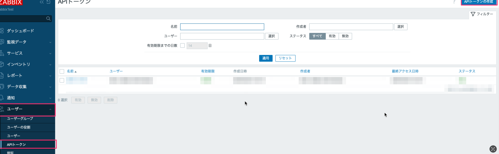

# はじめに

Zabbixの構築や各種設定、技術メモをまとめるためのリポジトリ。

## 利用環境

利用環境は以下を前提としている。

| 項目名       | 値                                                                                                                      |
| ------------ | ----------------------------------------------------------------------------------------------------------------------- |
| ホスト端末   | M2 MacBookAir                                                                                                           |
| ホスト端末OS | Sonoma 14.6.1                                                                                                           |
| 仮想環境     | VM Ware Fusion Pro(プロフェッショナル バージョン) 13.5.2 (23775688)                                                     |
| ゲストOS     | Redhat9.5                                                                                                               |
| MySQL        | 8.0.36                                                                                                                  |
| ZABBIX       | 7.2                                                                                                                     |
| Selenium     | 4.29.0                                                                                                                  |
| Webドライバ  | geckodriver 0.36.0  ※Firefox                                                                                            |
| その他       | Apache、PHPなどの各種ソフトウェアは、導入するZabbixのリポジトリ、バージョンに準じて自動的にインストールすることとする。 |
| Ansible      | ansible [core 2.18.1]                                                                                                   |

## 監視シナリオ

OSS製品であるSnipe-ITを監視対象とする前提でZabbix監視項目を作成する。監視する際のシナリオは以下の通り。

1. Snipe-ITのログイン画面にアクセスする
2. ログインフォームにユーザ名、パスワードを入力し、ログインする
3. ログイン後に表示されるHTML内に「ダッシュボード」文字列が含まれているかどうかを確認する

なお、監視する際にはSeleniumとWebドライバを用いてブラウザ監視を行うこととする。
※ZabbixのWebシナリオの場合、JavaScriptやCSRFトークンを処理するのが困難なため、Seleniumを用いる方法を採用している

## Ansible構成

本手順では、Ansibleで実行する前提としており、Ansibleで自動的にZabbixを構築できるようにプレイブックも同梱している。

ファイル構成は以下の通り。

| ファイル名                             | 概要                                                                                                                                                                                                                                            | 備考                                                                                                                                                                                                                                                                               |
| -------------------------------------- | ----------------------------------------------------------------------------------------------------------------------------------------------------------------------------------------------------------------------------------------------- | ---------------------------------------------------------------------------------------------------------------------------------------------------------------------------------------------------------------------------------------------------------------------------------- |
| `construction-zabbix-playbook.yml`     | OSに対してZabbixやMySQLといった各種ソフトウェアを導入するためのプレイブック本体。                                                                                                                                                               | 本リポジトリ内の`ansible`フォルダに存在。プレイブックの内容は基本的に、Zabbix公式サイトのガイドライン（<https://www.zabbix.com/jp/download?zabbix=7.2&os_distribution=red_hat_enterprise_linux&os_version=9&components=server_frontend_agent&db=mysql&ws=apache）を元にしている。> |
| `setup-inspection-zabbix-playbook.yml` | 構築済みのZabbixに対して、監視設定を追加するためのプレイブック本体。                                                                                                                                                                            | 本リポジトリ内の`ansible`フォルダに存在。プレイブックの内容は基本的に、Zabbix公式サイトのガイドライン（<https://www.zabbix.com/jp/download?zabbix=7.2&os_distribution=red_hat_enterprise_linux&os_version=9&components=server_frontend_agent&db=mysql&ws=apache）を元にしている。> |
| `ansible_settings.yml`                 | プレイブック実行時に必要となる各種設定情報をまとめたファイル。パスワードなどの機密情報を含んだファイル。各人で`ansible-vault`コマンドを実行してファイルを生成すること（こうすることで、ファイルを開く際にはパスワードが要求されるようになる）。 | 本リポジトリ内の`ansible`フォルダ内に雛形ファイル`ansible_secrets.yml.example`が存在する。  コピーして各人の環境に合わせて編集すること。                                                                                                                                           |
| `ansible_secrets.yml`                  | プレイブック実行時に必要となる機密情報（パスワードなど）をまとめたファイル。                                                                                                                                                                    |                                                                                                                                                                                                                                                                                    |
| `ansible_secrets.yml.example`          | `ansible_secrets.yml`の記述例を記載したファイル。                                                                                                                                                                                               |                                                                                                                                                                                                                                                                                    |
| `hosts`                                | 構築対象のホスト情報が定義されているファイル。                                                                                                                                                                                                  |                                                                                                                                                                                                                                                                                    |

最終的に下記の構成になるようにファイルを配置すること。

```text
ルートディレクトリ
  └ansible
    └construction-zabbix-playbook.yml
    └setup-inspection-zabbix-playbook.yml
    └ansible_settings.yml
    └ansible_secrets.yml
    └hosts
```

## Zabbix構築

### 機密情報定義ファイル作成

まず、以下のコマンドで機密情報定義定義ファイルを作成する。

なお、次回ファイルを開く際に必要な復号化用パスワード設定を求められるため、任意のパスワードを設定すること。

```bash
ansible-vault create ansible_secrets.yml

Vault password: <復号化用のパスワードを指定する>
Confirm New Vault password: <上記と同じパスワードを指定する>
```

---
■注意
Linux環境の場合、`ansible-vault`で生成したファイルを開く場合は、デフォルトだと`nano`となる。よって、以下のコマンドであらかじめVimを指定しておくと良い。

```bash
export EDITOR=vim
```

---

以下の通り記述すること。

| YAMLのキー | 設定する値 |
| ---------- | ---------- |

ansible/ansible_secrets.yml

```yml
# プレーンテキストの設定ファイルキー名と重複させないように、先頭にsecretsを付与する
secrets:
  mysql:
    accounts:
      root_user:
        password: <MySQLのルートユーザのパスワード>
      zabbix:
        # MySQLのユーザ名は、Zabbixの公式ドキュメント（https://www.zabbix.com/jp/download?zabbix=7.2）に則って設定すること
        username: zabbix
        password: <MySQLのZabbixユーザのパスワード>
```

編集後はエディタを閉じると自動的に保存される。

### プレイブック実行

以下のコマンドでプレイブックを実行すること。

※実行時に、`ansible-vault create`で作成したファイルのパスワードを確認されるため、入力すること

実行例：

```bash
ansible-playbook -i hosts construction-zabbix-playbook.yml --ask-vault-pass
```

上記実行後、以下のURLにアクセスし、Zabbixの初期設定を行うこと。

http://<対象のマシンのIPアドレス>/zabbix/setup.php

## Zabbixの監視設定作成

### APIトークンの発行

Zabbixのサイトにアクセスし、`ユーザー`→`APIトークン`→`APIトークンの作成`から発行すること。

【注意】発行したAPIトークンを必ず控えておくこと。発行直後しかコピーできないため、このタイミングを逃すと再発行が必要になる！



### 機密情報定義ファイルの編集

以下の通り記述すること。

| YAMLのキー                        | 設定する値                                      |
| --------------------------------- | ----------------------------------------------- |
| `api_token`                       | Zabbixから発行したAPIトークン                   |
| `target_host`→`ip`                | 監視対象のSnipe-ITのWebサイトのIPアドレス       |
| `target_host`→`macros`→`username` | Snipe-ITのWebサイトにログインする際のユーザ名   |
| `target_host`→`macros`→`password` | Snipe-ITのWebサイトにログインする際のパスワード |

ansible/ansible_secrets.yml

```yaml
・・・
  # Zabbix関連
  zabbix:
    # 発行したAPIトークン
    # ※Web画面から発行を行い、本ファイルに記述すること
    api_token: <Zabbixから発行したAPIトークン>

    target_host:
      # 監視対象のマシンのIPアドレス
      ip: "XXX.XXX.XXX.XXX"

      # 監視対象のSnipe-ITのログイン情報
      # Zabbixのアイテムに値を直接記述しないようにするために、マクロ変数として定義する
      macros:
         # ユーザ名
        username:
          macro: '{$SNIPE_IT_USERNAME}'
          value: <Snipe-ITのユーザ名>

        password:
          # パスワード
          macro: '{$SNIPE_IT_PASSWORD}'
          value: <Snipe-ITのパスワード>
```

### プレイブックを実行

作成後、以下のコマンドでプレイブックを実行すること。なお、この際の機密情報定義ファイル（ansible-vault）作成時に指定したパスワードを入力すること。

```bash
ansible-playbook -i hosts setup-inspection-zabbix-playbook.yml --ask-vault-pass
```

## 参考

### Zabbix APIのテストを効率的に行いたい

ZabbixへAPIリクエストするにあたって、VisualStudioCodeの`REST Client`(<https://marketplace.visualstudio.com/items?itemName=humao.rest-client)の利用を前提として、リクエスト用のテキストのサンプルファイルを以下に記述する。>を用いると良い。

具体的なリクエスト例は下記の通り。

ホストの一覧を取得：

```http
GET http://XXX.XXX.XXX.XXX/zabbix/api_jsonrpc.php
Content-Type: application/json
Authorization: Bearer <APIトークン>

{
    "jsonrpc": "2.0",
    "method": "host.get",
    "params": {
        "output": [
            "hostid",
            "host"
        ],
        "selectInterfaces": [
            "interfaceid",
            "ip"
        ]
    },
    "id": 2
}
```

正規表現を作成する：

```http
GET http://XXX.XXX.XXX.XXX/zabbix/api_jsonrpc.php
Content-Type: application/json
Authorization: Bearer <発行したAPIトークン>

{
    "jsonrpc": "2.0",
    "method": "regexp.create",
    "params": {
        "name": "Snipe-ITのダッシュボード画面表示判定",
        "expressions": [
            {
                "expression_type": 0,
                "expression": "ダッシュボード",
                "case_sensitive": 0
            }
        ]    },
    "id": 2
}
```
